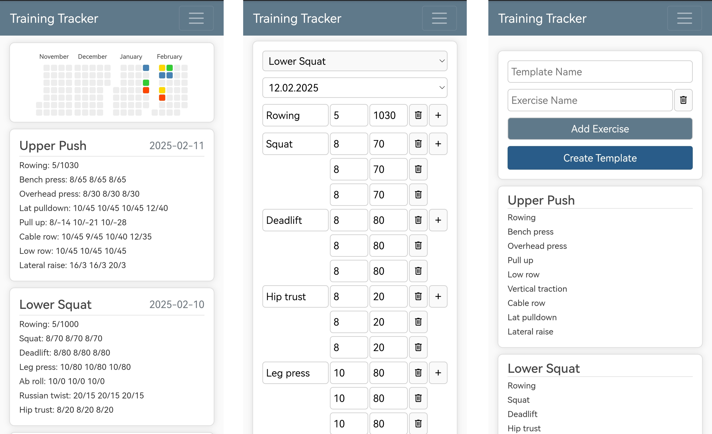

# Fitness Tracker

This application is designed to help you track your workouts efficiently.
You can create workout templates, log your exercises, and monitor your progress over time. The app remembers the
weights and repetitions from your last session and features an autocomplete function to make logging exercises quicker and easier.
Additionally, it provides graphical representations of your workout progress. The app connects to a database to store your workout data securely,
ensuring that your progress is saved and accessible across sessions.
Deploy it easily with SQLlight or Mariadb using the included docker-compose.yml file.




## Installation

### Docker Container

1. **Clone the repository**
   ```bash
   git clone https://github.com/yourusername/workout-tracker.git
   cd workout-tracker
   ```

2. **Create a .env file**
   Copy the example .env.example file to create your own .env file with the necessary configuration.
   ```bash
   cp .env.example .env
   ```
   Edit the .env file to include the appropriate settings for your environment (e.g., database credentials, secret keys).

3. **Set up Docker**
   Ensure you have Docker and Docker Compose installed on your machine. You can check the installation with:
   ```bash
   docker --version
   docker-compose --version
   ```

4. **Run the App Using Docker Compose**
   Once you have the .env file configured, you can start the app with one of the following commands based on your database configuration:

   **For MariaDB configuration:**
   If you've set `FLASK_ENV=mariadb` in your .env file:
   ```bash
   docker-compose up --build
   ```

   **For SQLite configuration:**
   If you've set `FLASK_ENV=sqlite` in your .env file:
   ```bash
   docker-compose -f docker-compose.sqlite.yml up --build
   ```

   These commands will build the Docker image (if needed) and start the application.

5. **Access the App**
   Once the app is running, you can access it at http://localhost:5000 and start tracking your workouts.

<<<<<<< HEAD
3. Set up Docker

    Ensure you have Docker and Docker Compose installed on your machine. You can check the installation with:

    ```bash
    docker --version
    docker-compose --version
    ```

4. Run the App Using Docker Compose

    Once you have the .env file set up, you can easily start the app by running:

    ```bash
    docker-compose up --build
    ```

    This will build the image (if necessary) and start the app.

5. Switching Between SQLlite and Mariadb mode

    The app can be run in either debug (SQLlight) or production (mariadb) mode. To switch modes, open the run.py file and set the environment variable to debug or production.

    Example:

    ```python
        app = create_app(environment='production') # use 'debug' for SQLlight
    ```

6. Access the App

    Once the app is running, you can access it at http://localhost:5000 and start tracking your workouts.
=======
>>>>>>> testing

## License
This project is licensed under the MIT License - see the LICENSE file for details.
